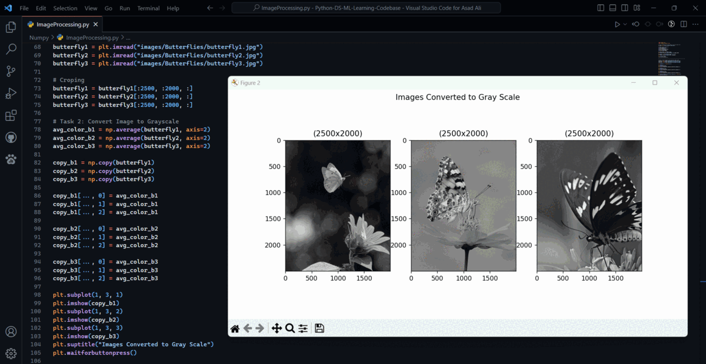

# NumPy_Basic_ImageProcessing
Python scripts demonstrating simple image processing techniques using popular library NumPy, The cornerstone of all other libraries

Welcome to the NumPy_Basic_ImageProcessing repository! This collection contains various Python tasks that demonstrate image processing techniques using popular libraries like NumPy. The script cover tasks such as image rotation, resizing, and grayscale conversion, providing a hands-on learning experience for image manipulation and analysis.

## Examples Included

### 1. Image Rotation
Learn how to rotate images using NumPy's powerful image manipulation capabilities. Code snippets showcase both 90-degree rotations and custom angle rotations.

### 2. Image Resizing
Discover techniques to resize images efficiently while maintaining aspect ratios. Practice cropping and resizing images to a common dimension for consistency.

### 3. Grayscale Conversion
Understand the process of converting colored images to grayscale using NumPy arrays. Observe the visual impact of removing color information from images.

## How to Use
1. Clone the repository to your local machine using `git clone`.
2. Navigate to the desired example task and run the Python script.
3. Observe the output images and experiment with different images to gain insights into image processing techniques.

## Requirements
- Python (3.x recommended)
- NumPy
- Matplotlib

## Technologies

## Contributions
Contributions to this repository are welcome! If you have any image processing techniques or improvements you'd like to add, feel free to submit a pull request.

## License
This repository is licensed under the [MIT License](LICENSE).
